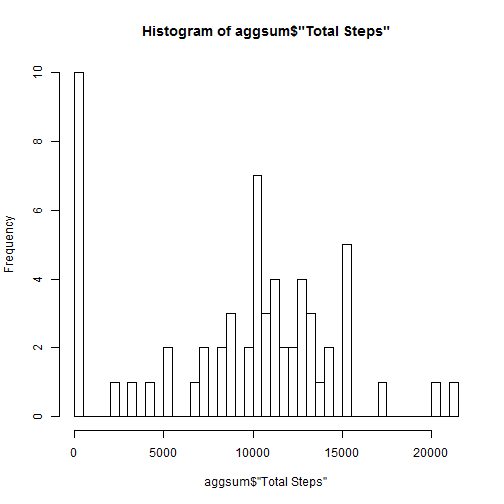
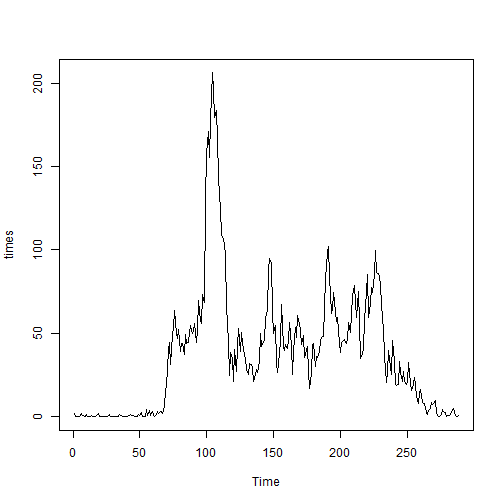
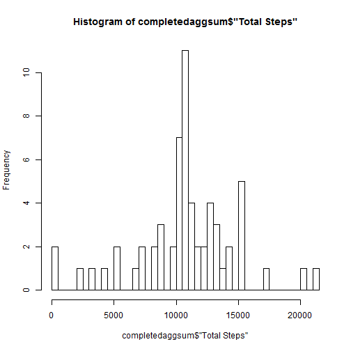
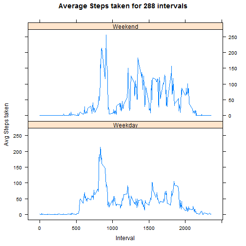

<style type="text/css">
p.import { color:green;}
p.import1{color:red;}
</style>


## Loading and preprocessing the data


```r
load<-read.csv("activity/activity.csv", header=TRUE,stringsAsFactors=FALSE)
data<-load
```


## What is mean total number of steps taken per day?


```r
aggmean<-aggregate(as.numeric(data$steps),list(data$date),mean,na.action=na.omit)
aggsum<-aggregate(as.numeric(data$steps),list(data$date),sum,na.rm=TRUE)

names(aggsum)<-c("Date","Total Steps")
names(aggmean)<-c("Date","Average Steps")


meanperdaymean<-mean(aggmean$"Average Steps", na.rm=TRUE)

meanperalldays<-mean(aggsum$"Total Steps",na.rm=TRUE)
total<-sum(aggsum$"Total Steps",na.rm=TRUE)
 medsteps<-median(aggsum$"Total Steps", na.rm=TRUE)
```
### <p class=import>Total Steps taken in the 2 months: 5.70608 &times; 10<sup>5</sup> steps</p>

### <p class=import>There are an average of 37.3825996 steps per interval. </p>

### <p class=import>There are an average of 9354.2295082 steps taken per day. </p>

### <p class=import>There is a median of 1.0395 &times; 10<sup>4</sup> steps taken per day. </p>

### Histogram of total steps.

```r
hist(aggsum$"Total Steps",breaks=length(aggsum$"Date"))
```

 


## What is the average daily activity pattern?


Take the average of each interval.
Plot a time series of averages for 1-288 intervals.

```r
aggin<-aggregate(as.numeric(data$steps),list(data$interval),mean, na.rm=TRUE)
names(aggin)<-c("Interval","Average Steps")
 times<-ts(aggin$"Average Steps",start=1,end=288, frequency=1)
plot(times)
```

 

What interval has the greatest average?

```r
mx<-max(aggin$"Average Steps")
mxs<-aggin[aggin$"Average Steps"==mx,]
```
### <p class=import>The largest average for any interval is 206.1698113 average steps taken interval per day. </p>
### <p class=import>The interval with the greatest average steps per day is interval 835 at 206.1698113 steps taken per day. </p>


## Imputing missing values


```r
comp<-complete.cases(data)
incomplete<-data[!comp,]
inc<-length(incomplete[[1]])
```
### <p class=import>The dataset has 2304 observations with missing values.</p>


```r
findint<-function(int,indf){

	steps<-0
	for(n in 1:length(indf[[1]]) )
	{ 
		if(indf[n,"Interval"]==int){
		steps<-indf[n,"Average Steps"]
	   	}
	}
	steps
}

fill<-function(df,indf){

	filled<-data.frame()
	for(i in 1:length(df[[1]]))
	{
		if(is.na(df$steps[i]))
		{
			df$steps[i]<- findint(df[i,"interval"], indf)
		}
	filled<-rbind(filled,df[i,])
	}
	filled
}
d<-data
i<-aggin
completedcases<-fill(d,i)
```
## Strategy:<p class=import1>Fill in missing values with the average number of steps for each missing interval.</p>

### Histogram of total steps in complete cases dataset

```r
completedaggsum<-aggregate(as.numeric(completedcases$steps),list(completedcases$date),sum,na.rm=TRUE)
names(completedaggsum)<-c("Date","Total Steps")
hist(completedaggsum$"Total Steps",breaks=length(completedaggsum$"Date"))
```

 

```r
completedmeanperalldays<-mean(completedaggsum$"Total Steps",na.rm=TRUE)
completedtotal<-sum(completedaggsum$"Total Steps",na.rm=TRUE)
 completedmedsteps<-median(completedaggsum$"Total Steps", na.rm=TRUE)
```
### <p class=import>Total Steps taken in the 2 months: 6.5673751 &times; 10<sup>5</sup> steps in the filled in dataset.</p>

### <p class=import>There are an average of 1.0766189 &times; 10<sup>4</sup> steps taken per day in the filled in data set. </p>

### <p class=import>There is a median of 1.0766189 &times; 10<sup>4</sup> steps taken per dayin the filled in dataset. </p>

### Do these values differ from the estimates from the first part of the assignment? 
The mean and median of the filled in dataset are close to the mean and median of the original data.
### What is the impact of imputing missing data on the estimates of the total daily number of steps?
By replacing missing values with the average steps taken for each interval, the mean is now equal to the median. Adding the averages into the missing values decreased the skew of the distribution of steps.


## Are there differences in activity patterns between weekdays and weekends?

Split add Weekend/Weekday factor to data set.

```r
getday<-function(obj){weekdays(as.Date(obj))}

days<-sapply(completedcases$date,getday)
casesdays<-cbind(completedcases,days)

week<-c("Monday","Tuesday","Wednesday","Thursday","Friday","Saturday","Sunday")
weekend<-c("Sunday","Saturday")

getweekend<-function(d, ke){
	result<-character()
	for(i in 1:length(ke)){
		if(d==ke[i])
			result<-"Weekend"
		else
			result<-"Weekday"
	}
	result
}

weekcat<-sapply(casesdays$days,getweekend, weekend)
weekcases<-cbind(casesdays,weekcat)
str(weekcases)
```

```
## 'data.frame':	17568 obs. of  5 variables:
##  $ steps   : num  1.717 0.3396 0.1321 0.1509 0.0755 ...
##  $ date    : chr  "2012-10-01" "2012-10-01" "2012-10-01" "2012-10-01" ...
##  $ interval: int  0 5 10 15 20 25 30 35 40 45 ...
##  $ days    : Factor w/ 7 levels "Friday","Monday",..: 2 2 2 2 2 2 2 2 2 2 ...
##  $ weekcat : Factor w/ 2 levels "Weekday","Weekend": 1 1 1 1 1 1 1 1 1 1 ...
```

```r
weekframes<-split(weekcases,weekcases$weekcat)
```

Get average steps per interval on weekdays

```r
weekdayaggin<-aggregate(as.numeric(weekframes[[1]]$steps),list(weekframes[[1]]$interval),mean, na.rm=TRUE)

names(weekdayaggin)<-c("Interval","Average Steps")
weekdaytimes<-ts(weekdayaggin$"Average Steps",start=1,end=288, frequency=1)
weekdayaggin$weekcat<-"Weekday"
```

Get average steps per interval on weekends

```r
weekendaggin<-aggregate(as.numeric(weekframes[[2]]$steps),list(weekframes[[2]]$interval),mean, na.rm=TRUE)

names(weekendaggin)<-c("Interval","Average Steps")
weekendtimes<-ts(weekendaggin$"Average Steps",start=1,end=288, frequency=1)
weekendaggin$weekcat<-"Weekend"
```

### Plot averages for weekend and weekdays

```r
weekaggin<-rbind(weekdayaggin,weekendaggin)
library(lattice)
xyplot(weekaggin$"Average Steps" ~ weekaggin$Interval | weekaggin$weekcat,type="l", main="Average Steps taken for 288 intervals",layout=c(1,2),xlab="Interval",ylab="Avg Steps taken")
```

 

